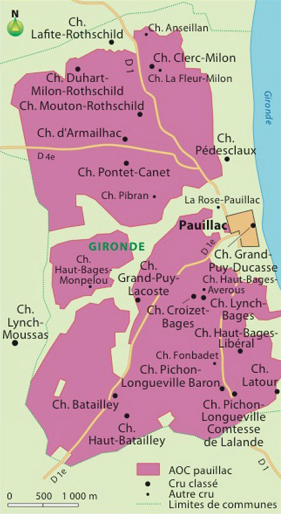

# L'AOC Pauillac

## Géographie

## Informations techniques

**Cépages :** Cabernet franc • Cabernet-sauvignon • Merlot

## Description Hachette

Capitale du Médoc viticole, la ville portuaire de Pauillac a donné son nom à une appellation d'une grande homogénéité de terroir. Sur la rive gauche de la Gironde, l'aire se présente comme un vaste plan incliné qui culmine à l'ouest et descend doucement vers l'estuaire. Elle est constituée d'un bel ensemble d'affleurements de graves. Avec dix-huit crus classés, dont trois premiers, la renommée de l'appellation est à la hauteur de son terroir et de son histoire héritée des anciennes seigneuries et des propriétés de parlementaires des XVII e et XVIII e siècles. Les pauillac allient finesse et puissance tannique, dont le corollaire est une exceptionnelle aptitude au vieillissement.

**Œil :** La robe des vins de Pauillac annonce leur caractère corsé par une densité et une profondeur souvent impressionnantes. Leur couleur peut aller du rubis foncé au grenat, en passant par le rouge sombre.

**Nez :** Le bouquet des pauillac allie puissance, complexité et délicatesse. Couronnant le mariage parfaitement réussi des griottes et des petits fruits rouges, avec de subtiles notes de fumet, de vanille et de cuir, le cassis rappelle la place dominante du cabernet-sauvignon dans l'encépagement. L'élevage contribue lui aussi à l'enrichissement de la palette avec des notes de torréfaction, d'épices, de réglisse et de vanille.

**Bouche :** Corsés, puissants et charpentés, les pauillac trouvent leur parfaite expression au palais. Leur caractère évolue avec le temps. Jeunes, ils sont marqués par leur forte présence tannique qui peut leur donner un côté ferme mais qui leur permet d'affronter avec succès des mets assez goûteux. Avec les années, les tanins s'arrondissant et les arômes s'ouvrant, ils perdent assez rapidement leur agressivité pour acquérir un caractère fin et délicat, tout en conservant une grande puissance. C'est ce mélange de corps et d'élégance qui invite à les servir sur des mets à la fois forts et raffinés, comme les gibiers ou les poissons fins.