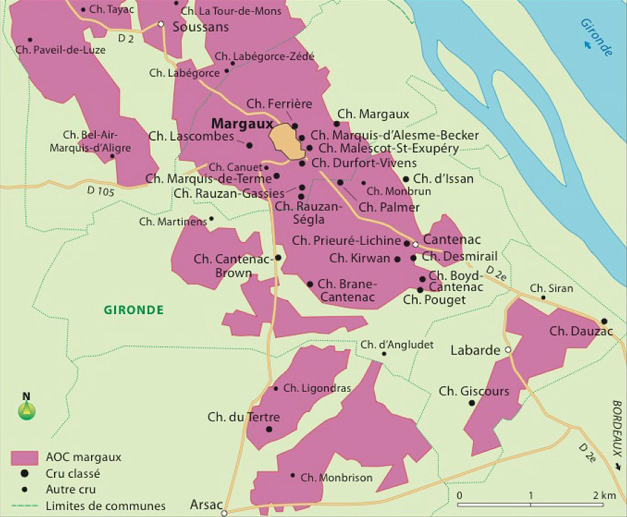

# L'AOC Margaux

## Géographie

## Informations techniques

**Cépages :** Cabernet franc, Cabernet-sauvignon, Merlot

## Description Hachette

Margaux est la seule AOC communale du Haut-Médoc à porter le nom d'un premier grand cru classé. Son aire s'étend sur cinq communes : Margaux, Cantenac, Labarde, Soussans et Arsac. L'appellation, qui sélectionne les meilleurs sols, possède quelques-unes des plus belles croupes de graves de tout le Bordelais. Celles-ci communiquent aux margaux leur grande finesse aromatique, leur harmonie et leur aptitude au vieillissement.

**Œil :** La robe du margaux s'inscrit dans la tradition médocaine par son intensité qui se maintient longtemps au vieillissement. Jeune, le vin annonce sa structure et son potentiel de garde par une teinte puissante, entre rubis et grenat.

**Nez :** La vivacité et l'élégance apparaissent dans une palette exceptionnellement large et complexe. Très tôt, les fruits tiennent une place importante (cerise, groseille) auxquels se mêlent des notes qui invitent au voyage : cannelle, épices, torréfaction. En vieillissant, le bouquet offre des parfums de sous-bois et de champignon, de clou de girofle.

**Bouche :** Riche, ample et bien charpenté, le margaux montre dans sa jeunesse ses ambitions, mais il le fait sans aspérité ni arrogance, sa souplesse et sa complexité aromatique, qui rejoint celle du nez, lui donnant un caractère harmonieux et séduisant. Fine, savoureuse et persistante, la finale s'inscrit dans le droit fil. Parfaitement constitué, le margaux évolue très heureusement tout au long de sa vie. Les tanins se fondent peu à peu pour donner un ensemble rond, chaleureux, suave. La finale laisse le dégustateur sur une impression harmonieuse de finesse et d'élégance.

**Mets vins :** Viande rouge et blanche, volaille, gibier, fromages.