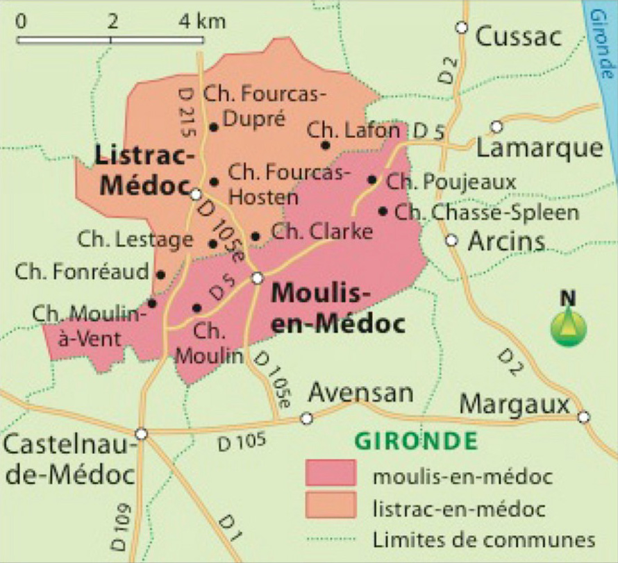

# L'AOC Moulis-en-médoc

## Géographie

## Informations techniques

## Description Hachette

Contrairement aux autres appellations communales du Médoc, moulis ne présente pas une forme ramassée mais s'étire en un étroit ruban de 12 km de long sur à peine 300 ou 400 m de large. Très importante pour l'identité de l'appellation est la forte représentation des crus bourgeois, dont Moulis est l'une des terres d'élection. Avec listrac, moulis est en effet la seule AOC communale à ne pas posséder de crus classés. Les vins savent affirmer leur personnalité, unis par leur bonne aptitude à la garde, par la complexité de leur bouquet et par leur finesse. La diversité des terroirs (graves, marnes calcaires) se retrouve dans les vins.

**Œil :** La robe d'un beau rubis foncé à reflets sombres annonce de grandes possibilités de garde.

**Nez :** Charmeurs et nombreux, les parfums forment un bouquet où dominent les notes fruitées. La palette se décline, des fruits rouges mûrs au pain grillé, en passant par la réglisse, les notes de torréfaction ou de tabac.

**Bouche :** On retrouve au palais l'expression aromatique complexe du bouquet : fruits rouges frais, fruits cuits, vanille, cannelle, réglisse, violette, épices, café torréfié et sous-bois. Très enrobée, la charpente est soutenue par des tanins veloutés et savoureux. D'une manière générale, les moulis offrent un caractère moelleux et plein, avec une délicatesse et un fruité qui leur permettent souvent de s'épanouir un peu plus rapidement que les vins des autres AOC communales du Médoc.

**Mets vins :** Agneau, gibier à plume (perdrix).