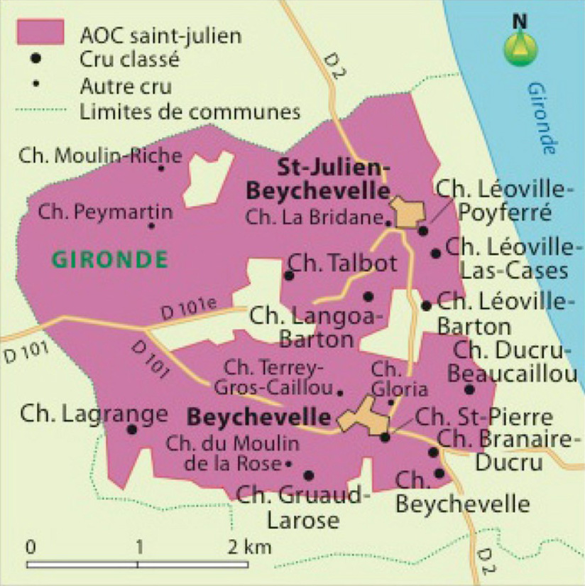

# L'AOC Saint-julien

## Géographie

## Informations techniques

**Cépages :** Cabernet franc • Cabernet-sauvignon • Côt • Malbec • Merlot • Petit verdot

## Description Hachette

La commune de Saint-Julien-Beychevelle possède des terroirs exceptionnels, caractérisés par de doux vallonnements. Associés aux graves, ces versants assurent un bon écoulement des eaux pluviales. Ainsi n'est-il pas étonnant de trouver ici quelques-uns des crus les plus réputés, tels les châteaux Beychevelle, Talbot, Ducru-Beaucaillou. La position de saint-julien en fait le centre géographique du Médoc viticole, à mi-chemin entre Blanquefort et Jau, comme entre Margaux et Saint-Estèphe. Les saint-julien, qui présentent une remarquable aptitude au vieillissement, ont la réputation d'associer la puissance et la sève des vins des appellations communales du nord (saint-estèphe et pauillac) avec la finesse des margaux.

**Œil :** D'une couleur rubis foncé dans sa jeunesse, le saint-julien conserve longtemps une robe profonde. Dix ou douze ans après la vendange, il continue de surprendre par son côté sombre, presque noir.

**Nez :** La complexité du bouquet est grande. La violette se marie aux arômes empyreumatiques, autour desquels gravitent de multiples notes : myrtille, mûre, tabac brun, griotte, cacao, pruneau, vanille, caramel... Avec l'âge apparaissent des senteurs de gibier, de truffe ou de cuir de Russie.

**Bouche :** Le palais révèle de la richesse, de la sève et beaucoup d'élégance. Fermes et puissants, les tanins se portent garants des chances d'évolution du saint-julien, qui possède une trame serrée et une grande concentration. Toutefois, ils charment par leur velouté que soutient un boisé de qualité. L'impression d'harmonie que procure la dégustation d'un saint-julien jeune se renforce lorsqu'il avance en âge. C'est un vin qu'il faut savoir oublier dans sa cave pour le redécouvrir dix, douze, voire quinze ou vingt ans plus tard. Alors, la trame a changé. Délicate, parfois même fleurie, elle s'est délicieusement enrobée. La charpente tannique est encore bien présente, mais le vin peut montrer son ampleur et sa plénitude sans manifester la moindre agressivité. Avec le temps, la finale a gagné en complexité et en élégance pour parvenir à un niveau de subtilité aromatique exceptionnel.