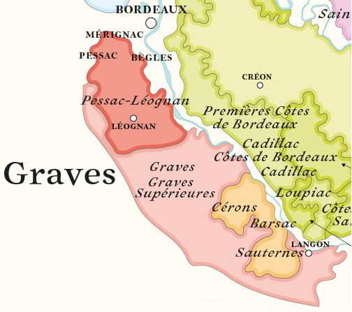

# Le Vignoble Bordelais, rive gauche

## 1. Les cépages

- Cabernet Sauvignon
- Cabernet Franc
- Merlot
- Petit Verdot (marginal)
- Malbec (très marginal)

## 2. Les classements

#### Le Classement de 1855 des vins rouges (Médoc).

61 crus dont cinq premiers crus, quatorze seconds crus, quatorze troisièmes crus, dix quatrièmes crus et dix huit cinquièmes crus.

- **Premiers crus:**
- - **Margaux :** Margaux
  - **Pauillac :** Lafite Rothschild, Latour, Mouton Rothschild (promu de 2ème à 1er en 1973)
  - **Graves :** Haut-Brion (c'est l'exception !)
- **Deuxième crus :** 
- - **Margaux :** Brane-Cantenac, Dufort-Vivens, Lascombes, Rauzan-Gassies, Rauzan-Ségla
  - **Pauillac :** Pichon Baron, Pichon-Longueville Comtesse de Lalande,
  - **Saint-Estèphe :** Cos d'Estournel, Montrose
  - **Saint-Julien :** Ducru-Beaucaillou, Gruaud Larose, Léoville Barton, Léoville Las Cases, Léoville Poyferré
- **Troisièmes crus :**

#### Le classement de 1855 des vins blancs et moelleux (Médoc)

#### Les grands crus classés des graves

## 4. Les appellations des Graves

La région des Graves constitue le **vignoble historique de Bordeaux**, mis en valeur dès l'Antiquité. Etendue sur la rive gauche de la Garonne, de Bordeaux au sud de Langon, elle doit son nom à ses sols faits de **cailloux roulés**, réputés depuis le Moyen Age, où l'on parlait de *Grabas de Burdeus*.

Des sols à l'origine de **vins rouges et blancs**, principalement secs (les vins doux possèdent une AOC spécifique : les graves supérieures), qui comptent parmi les meilleurs du Bordelais, dont certains **crus classés de prestige** en appellation **pessac-léognan**.

En tête, le célèbre **Château Haut-Brion**, premier château du vin et premier cru du Bordelais à connaître la célébrité en Grande-Bretagne dès le XVIIe. Le seul cru non médocain à avoir intégré le classement de 1855, tout en figurant aussi dans le classement des Graves (1953), composé exclusivement de pessac-léognan et le seul aujourd'hui en Gironde à comprendre aussi bien des vins blancs secs que des vins rouges.

### AOC Graves

**Vins produits :** 75 % rouges et 25 % blancs

**Oeil :** Classique du Bordelais par sa couleur, entre rubis et pourpre, la robe chatoyante des graves rouges annonce leur aptitude à la garde par sa teinte foncée. Or pâle à reflets verts ou jaune pâle à reflets or, la couleur du graves blanc signe souvent son mode d'élaboration.

**Nez :** (**Rouges :**) Ces vins sont parmi les plus typés de la Gironde. En effet, beaucoup se reconnaissent à leur parfum de violette, accompagné d'une note de fumée. On découvre aussi des fruits rouges et des notes allant du gibier aux fleurs, en passant par les épices, le moka ou la torréfaction. (**Blancs :**) Parmi les parfums les plus caractéristiques, on décèle dans les vins blancs le genêt, les agrumes et les fruits exotiques.

**Bouche :** (**Rouges :**) c'est au palais que les graves rouges trouvent leur expression la plus complète. Celle-ci repose sur l'équilibre entre la puissance de la charpente et la rondeur. Les vins les plus réussis parviennent, en effet, à posséder beaucoup d'ampleur et de volume, tout en restant charmeurs. L'élégance du bouquet se retrouve au palais, qui débouche sur une longue finale veloutée. (**Blancs :**) Corsés et charnus, frais et parfumés (fleurs), les graves blancs sont très aromatiques. Pour les meilleurs, on peut envisager une garde de quelques années.

**Mets vins:** (**Rouges :**) viande rouge, gibier à plume, fromages. (**Blancs :**) fruits de mer, poisson en sauce, viande blanche.

### AOC Pessac-léognan (1987) - Blancs secs et Rouges

Autrefois AOC graves, en partie enclavé dans la banlieue bordelaise, le vignoble de Pessac-Léognan est l'un des plus anciens de la région, déjà célèbre au Moyen Âge. Aujourd'hui, il s'étend sur les communes de Cadaujac, Canéjean, Gradignan, Léognan, Martillac, Mérignac, Pessac, Saint-Médard-d'Eyrans, Talence et Villenave-d'Ornon. Sol pauvre, croupes aux fortes pentes, réseau hydrographique bien constitué, son terroir forme un ensemble homogène. Ses qualités viticoles sont suffisamment exceptionnelles pour qu'en 1855, Haut-Brion, cru emblématique dès le XVII e siècle, ait pu figurer aux côtés des châteaux médocains dans le groupe des premiers crus du classement impérial. Pourtant, il a fallu attendre 1953 pour que d'autres crus soient classés en rouge et 1959 pour que naisse le classement des vins blancs.

**Cépages :** (**Rouges :**) : Cabernet franc • Cabernet-sauvignon • Côt • Malbec • Merlot. (**Blancs :**) Muscadelle • Petit verdot • Sauvignon • Sémillon

**Œil :** (**Rouges :**) D'emblée, la robe du pessac-léognan rouge annonce l'élégance et les potentialités de garde du vin ; elle est d'un rouge profond à reflets violets ou d'une teinte cerise noire. (**Blancs :**) Le pessac-léognan blanc a belle allure ; il peut être d'un jaune doré brillant, presque blanc, ou chatoyant à reflets verts. Il est toujours distingué.

**Nez :** (**Rouges :**) Puissant et complexe, le bouquet des vins rouges développe des parfums dominants de fruits rouges bien mûrs et des notes florales, telle la violette, caractéristiques des graves. La palette aromatique s'agrémente de touches de fumée, de pain grillé et surtout de cuir. (**Blancs :**) Le pessac-léognan blanc fait preuve d'une égale complexité. Il développe de profonds et délicats arômes qui vont du pain grillé à de fines notes de citron et de fruits exotiques, en passant par une savoureuse odeur de noisette.

**Bouche :** (**Rouges :**) Jeune, le pessac-léognan rouge se montre charpenté, tout en restant parfaitement équilibré et élégant. Déjà, il affirme sa typicité par des arômes de fruits, de sous-bois, de terre chaude. En vieillissant, la palette se développe : fruits cuits ou secs, confiture, gibier, cacao, café. (**Blancs :**) Aussi concentré que complexe, le vin blanc affirme sa personnalité par un côté non seulement gras et onctueux, mais aussi d'une grande fraîcheur, caractéristique de l'appellation. Il possède un très bon équilibre.

**Mets vins :** (**Rouges :**) Gibier à plume, viande rouge ou blanche, fricassée de champignons. (**Blancs :**) Crustacés, poisson en sauce, fromages à pâte dure.

### AOC Graves-supérieures (1937) - Blancs moelleux

**Cépages :** Muscadelle • Sauvignon • Sémillon
