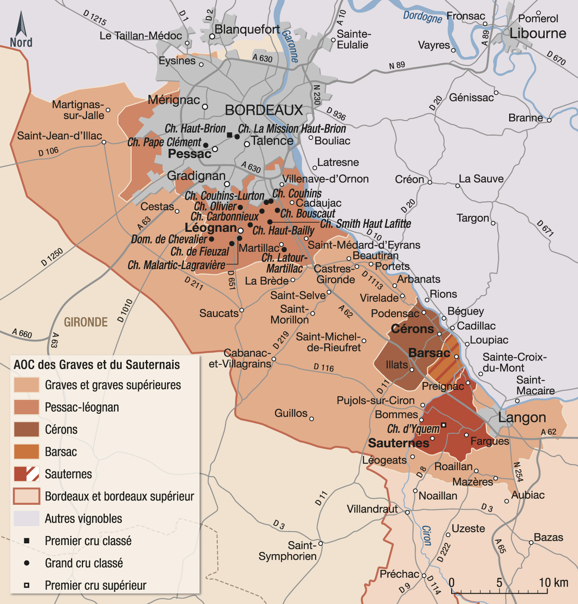

# La région des Graves

## Géographie

[Carte simplifiée](../figures/Graves.jpg)

## Description Hachette

La région des Graves constitue le **vignoble historique de Bordeaux**, mis en valeur dès l'Antiquité. Etendue sur la rive gauche de la Garonne, de Bordeaux au sud de Langon, elle doit son nom à ses sols faits de **cailloux roulés**, réputés depuis le Moyen Age, où l'on parlait de *Grabas de Burdeus*.

Des sols à l'origine de **vins rouges et blancs**, principalement secs (les vins doux possèdent une AOC spécifique : les graves supérieures), qui comptent parmi les meilleurs du Bordelais, dont certains **crus classés de prestige** en appellation **pessac-léognan**.

En tête, le célèbre **Château Haut-Brion**, premier château du vin et premier cru du Bordelais à connaître la célébrité en Grande-Bretagne dès le XVIIe. Le seul cru non médocain à avoir intégré le classement de 1855, tout en figurant aussi dans le classement des Graves (1953), composé exclusivement de pessac-léognan et le seul aujourd'hui en Gironde à comprendre aussi bien des vins blancs secs que des vins rouges.

## Les AOCs des Graves

- [L'AOC Graves](../AOCs/AOC_Graves.md)
- [L'AOC Graves-supérieures](../AOCs/AOC_Graves-supérieures.md)
- [L'AOC Pessac-léognan](../AOCs/AOC_Pessac-léognan.md)